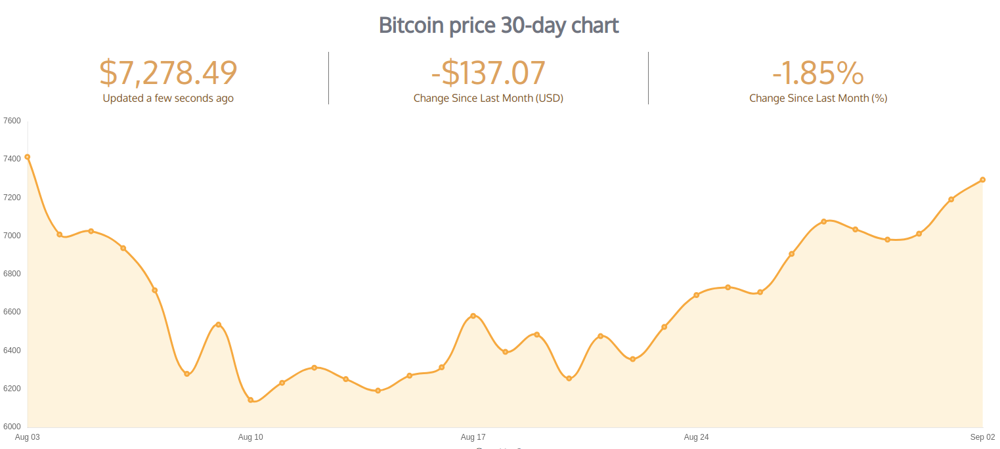

# React-Bitcoin-Chart
## Bitcoin price 30-day interactive chart.

## Get Started.

1. **Clone this repository.** - `git clone https://github.com/Peace4Every1/React-Bitcoin-Chart`
2. **Make sure you're in the directory you just created.** - `cd React-Bitcoin-Chart`
3. **Install Node Packages.** - `npm install`
4. **Run the app.** - `npm start`

**Inspired by the [Coinbase Chart](https://www.coinbase.com/charts)**
